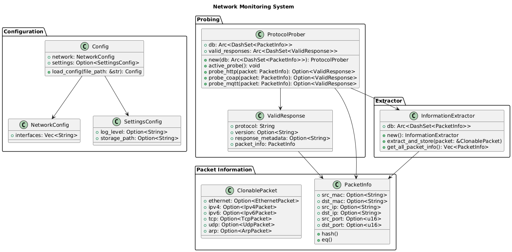

# NetFlex

## Overview

NetFlex is designed to capture and analyze network traffic in real-time. It extracts useful metadata from network packets and probes specific protocols (HTTP, COAP, MQTT) to validate active services or devices on the network. The system is built using Rust and employs asynchronous execution using tokio to handle multiple tasks efficiently.

## UML



## Features

`Packet Capture & Extraction:` Extracts metadata such as MAC addresses, IP addresses, and transport layer ports from network packets.

`Protocol Probing:` Actively probes common protocols (HTTP, COAP, MQTT) using the extracted packet information.

`Unique Storage:` Utilizes DashSet to store unique entries for both packet metadata and protocol probing results.

`Modular Design:` Extensible and structured to allow future additions and protocol support.

`Asynchronous Probing:` Uses tokio's runtime for efficient concurrency.

## Directory Structure

```
├── src
│   ├── main.rs               # Entry point for the program
│   ├── config.rs             # Handles configuration loading
│   ├── monitors.rs           # Network interface monitoring logic
│   ├── packet.rs             # Packet handling and parsing logic
│   ├── pipeline.rs           # Traffic processing pipeline
│   ├── extractor.rs          # Packet information extraction
│   ├── probe.rs              # Active protocol probing
└── Cargo.toml                # Dependencies and project metadata
```

## Configuration

The system loads its configuration from a JSON file. The configuration specifies network interfaces to monitor and optional logging and storage settings.

config.rs

    Structs:
        Config: Contains network and settings configuration.
        NetworkConfig: Defines network interfaces to monitor.
        SettingsConfig: Holds optional settings like log level and storage path.

    Function:
        load_config(file_path: &str) -> Config: Reads the configuration file asynchronously using tokio::fs and parses it using serde_json.

Example Configuration:

```json
{
  "network": {
    "interfaces": ["eth0", "wlan0"]
  },
  "settings": {
    "log_level": "debug",
    "storage_path": "/var/log/network_monitor"
  }
}
```

## Packet Information Extraction

extractor.rs

    `PacketInfo:` Represents packet metadata (e.g., MAC addresses, IP addresses, and transport layer ports).
        Implements Hash and PartialEq to ensure uniqueness in DashSet.
    `InformationExtractor:` Responsible for extracting packet data and storing it in a DashSet.
        extract_and_store(packet: &ClonablePacket): Extracts metadata from the packet and stores it in the set.
        get_all_packet_info(): Returns all stored unique packet information.

Packet Metadata Example:

```rust
PacketInfo {
    src_mac: Some("00:1B:44:11:3A:B7"),
    dst_mac: Some("00:1B:44:11:3A:B8"),
    src_ip: Some("192.168.1.2"),
    dst_ip: Some("192.168.1.3"),
    src_port: Some(443),
    dst_port: Some(8080)
}
```

## Active Protocol Probing

probe.rs

The system actively probes common protocols based on the extracted packet metadata to validate network services.

    `ProtocolProber:`
        active_probe(): Probes various protocols like HTTP, COAP, and MQTT for each PacketInfo in the DashSet.
        probe_http(), probe_coap(), and probe_mqtt(): Perform protocol-specific probing and store valid responses.

    `ValidResponse:` Represents a successful protocol response containing metadata and associated PacketInfo.

Example Protocol Probing:

    `HTTP Probe:`
        Constructs an HTTP GET request using reqwest and stores response metadata (e.g., headers).

    `COAP Probe:`
        Sends a CoAP discovery request to the target using coap_lite.

    `MQTT Probe:`
        Subscribes to a topic using rumqttc to validate an MQTT broker.